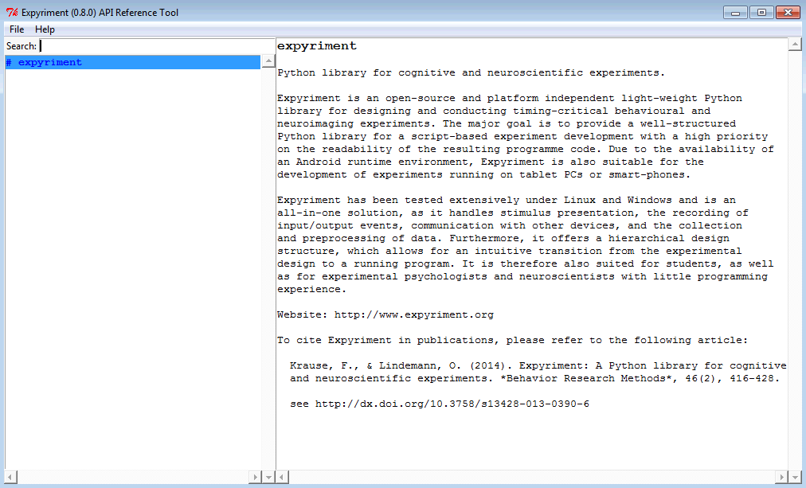

API reference tool
==================
Besides this HTML documentation, Expyriment includes a full offline API
reference tool which will allow you to browse and search the API offline, 
using a graphical user interface.

Usage
-----
To show the API reference tool, call the following from within Python::

    expyriment.show_documentation(3)

Alternatively, the API reference tool can be started with the :doc:`CommandLineInterface`::

    python -m expyriment.cli -A

