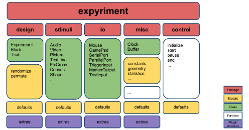

Overview
========

**Expyriment** is an open-source and platform independent light-weight Python 
library for designing and conducting timing-critical behavioural and 
neuroimaging experiments. The major goal is to provide a well-structured Python 
library for a script-based experiment development with a high priority on the 
readability of the resulting programme code. It has been tested extensively 
under Linux and Windows. 

**Expyriment** is an all-in-one solution, as it handles the stimulus 
presentation, recording of I/O events, communication with other devices and the 
collection and preprocessing of data. It offers furthermore a hierarchical 
design structure, which allows an intuitive transition from the experimental 
design to a running programme. It is therefore also suited for students as well 
as experimental psychologists and neuroscientists with little programming 
experience.

*Website*: http://www.expyriment.org

*Authors:*

* `Florian Krause <http://www.floriankrause.org>`_, Donders Institute, RadboudUMC Nijmegen, The Netherlands
    
* `Oliver Lindemann 
  <http://www.cognitive-psychology.eu/lindemann/>`_, Erasmus University Rotterdam, The Netherlands

Publications & citation
-----------------------
If you have used Expyriment in your work, please cite the following 
publication:

    Krause, F., & Lindemann, O. (2014). Expyriment: A Python library for
    cognitive and neuroscientific experiments. *Behavior Research Methods*, 46(2),
    416-428. `doi:10.3758/s13428-013-0390-6 <http://dx.doi.org/10.3758/s13428-013-0390-6>`_

Main features
-------------
* Easy syntax, very readable (due to Python)
* Cross-platform (Linux, Windows, OS X)
* Allows for fast and efficient programming of experiments (do more with less 
  code)
* A variety of standard stimuli (Text, Picture, Audio, Video etc.)
* Keyboard, Mouse, Serial Port, Parallel Port and Gamepad support
* Hierarchical structure of experimental units (Experiment, Blocks, Trials, Stimuli)

For a full documentation of all Expyriment functionality (i.e. all available 
modules, classes, methods, functions, constants, and attributes provided by the 
Expyriment Python package), please have a look at the :doc:`API reference pages 
<expyriment>`

Example code
------------
Examples of full experiments can be found :doc:`here <Examples>`.

Creating experiments, blocks, trials and stimuli::

    exp = expyriment.design.Experiment()
    block = expyriment.design.Block()
    trial = expyriment.design.Trial()
    stimulus = expyriment.stimuli.TextLine(text="Hello World")

Building a hierarchy between various structures::

    trial.add_stimulus(stimulus)
    block.add_trial(trial)
    exp.add_block(block)

Presenting stimuli::

    for block in exp.blocks:
        for trial in block.trials:
            trial.stimuli[0].present()

Handling input devices::

    button, rt = exp.keyboard.wait([expyriment.misc.constants.K_SPACE])

Logging data::

    exp.data.add([button, rt])

Licence
-------
Expyriment is free software and released under the Open Source `GNU General 
Public Licence <http://www.gnu.org/copyleft/gpl.html>`_ of the Free Software 
Foundation.

Source code repository
----------------------
The `Expyriment source code repository
<https://github.com/expyriment/expyriment>`_ is currently hosted on 
GitHub. Get a local copy of this repository with this command::

    git clone https://github.com/expyriment/expyriment.git    

Suggestions and bug tracking
----------------------------
If you want to make suggestions to improve Expyriment or you found a bug, 
please post your comments to the `Expyriment issues page 
<https://github.com/expyriment/expyriment/issues>`_ or contact us directly by 
sending an email to info@expyriment.org.

Mailing lists
-------------
**Expyriment newsletter**: All users of Expyriment should subscribe to the 
Expyriment newsletter, since the project is still under development. All 
modifications and new versions will be announced via this mailing list. (Visit 
http://groups.google.com/group/expyriment or send an email 
to expyriment+subscribe@googlegroups.com). 
    
**Expyriment users mailing list**: If you have questions regarding the 
installation, usage or documentation of Expyriment please don't hesitate to 
contact the Expyriment users mailing list (visit
http://groups.google.com/group/expyriment-users or send an email to 
expyriment-users+subscribe@googlegroups.com) or contact us directly by sending 
an email to info@expyriment.org.  

Forum
-----
The new official Expyriment support forum can be found at http://forum.expyriment.org.

Matrix/IRC channel
------------------
To ask questions or to have real-time discussions with other users and the developers you can also use our `Matrix chat <https://riot.im/app/#/room/#expyriment:matrix.org>`_. The room is also accesible from IRC::

    Server: irc.freenode.org
    Channel: #expyriment

Social networks
---------------
* Subscribe to `/r/expyriment <http://www.reddit.com/r/expyriment>`_ on Reddit
* Follow `@expyriment <http://www.twitter.com/expyriment>`_ on Twitter
* Like `Expyriment <http://www.facebook.com/expyriment>`_ on Facebook

Related projects
----------------
If you are looking for a graphical experiment builder, we suggest OpenSesame, 
which uses Expyriment as the default back-end: http://www.osdoc.cogsci.nl/.
