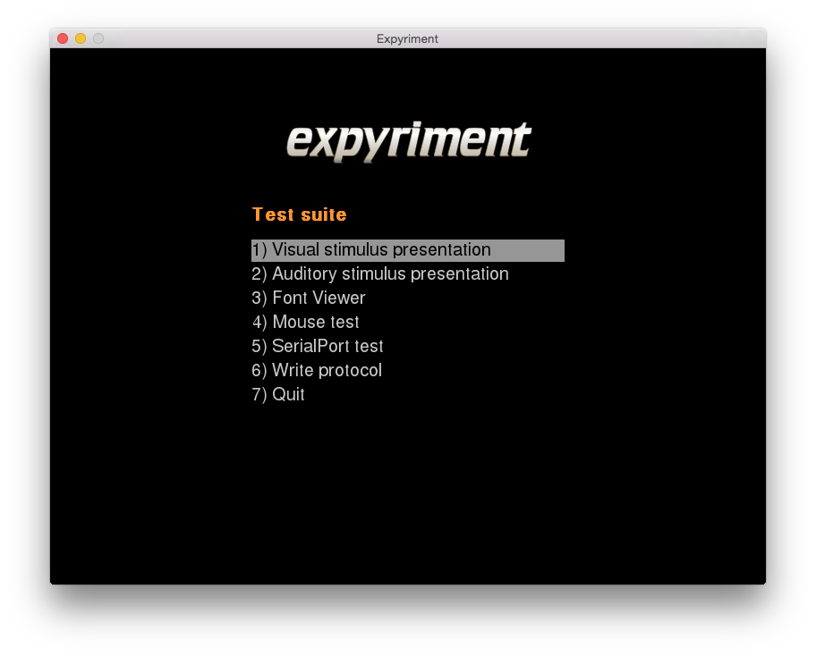

Expyriment test suite
=====================

The Expyriment test suite is a guided tool for testing your computer's 
abilities and performance. This includes timing accuracy of visual stimulus
presentation, audio playback functionality, mouse functionality and
serial/parallel port functionality.

Eventually, all test results can be saved as a protocol, together with some 
information about the system.

Usage
-----
Starting the test suite
~~~~~~~~~~~~~~~~~~~~~~~
The test suite can either be started from within an experiment, or from an 
interactive Python session (for instance with IPython). To start the test 
suite, just call::

    import expyriment
    expyriment.control.run_test_suite()

Alternatively, you can start the test suite from the command line using the 
:doc:`Command line interface <CommandLineInterface>`::

   $ python -m expyriment.cli -T 

**Please note that all changes to the** :doc:`Defaults` **prior to starting the test suite apply!**

Menu overview
~~~~~~~~~~~~~
Here is a brief explanation of the available options:

1. **Visual stimulus presentation**

 * Tests the visual stimulus presentation timing specifics of the system

 The following results will be reported:
  * *Estimated Screen Refresh Rate*: The refresh rate of the screen in Hz and
    the approximated time of a single refresh in milliseconds. The most common refresh
    rate is arguably 60Hz (marked green), but specialised displays might also have
    refresh rates between 50 and 120 Hz (marked orange). Reported refresh rates outside
    of this range (marged red) are most probably erroneous.
  * *Detected Framebuffer Pages*: The amount of buffers used for drawing to the
    screen; if only one buffer is used, new stimuli will be drawn directly to the
    screen; if two buffers (double buffer) are used, new stimuli will be drawn to
    an additional page, and a screen update will replace the screen with this page
    and put the screen contents into the page (i.e. the two buffers are swapped);
    if three buffers (tripple buffer) are used, new stimuli will be drawn to a third
    page, and a screen update will replace the screen with this page, and put the
    screen contents into the second page (i.e. a history of 2 former screens is
    kept)
  * *Average Reporting Inaccuracy*: The average time in milliseconds between Expyriment
    reporting that the stimulus has been presented (i.e. the present() method
    returns) and the actual time the stimulus could actually been physically
    shown on the screen, given the refresh rate; an inaccuracy of 0 milliseconds (marked
    green) will indicate that blocking on the vertical retrace functions
    properly; an inaccuracy of 1 millisecond or more (marked red) will indicate that
    blocking on the vertical does not function properly
  * *Unexplained Presentation Delays*: The amount in percent of presentations
    that will take longer than a single refresh rate
  * A histogram showing the obtained presentation timings

2. **Auditory stimulus presentation**

  * Tests functionality of audio playback

3. **Font viewer**

 * Test installed fonts

4. **Mouse test**

 * Tests mouse accuracy (polling time)
 * Tests functionality of mouse buttons

5. **Parallel Port test**

 * Tests functionality of devices connected via the parallel port

6. **Serial port test**

 * Tests functionality of devices connected via the serial port

7. **Write protocol**

 * Saves all test results, as well as information about the system, as a text 
   file.

8. **Quit**

 * Quits the test suite
