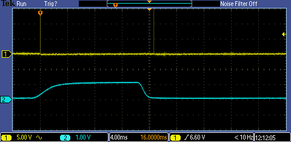
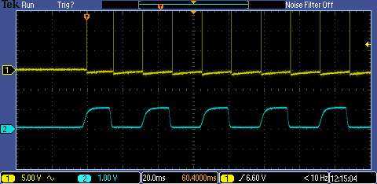
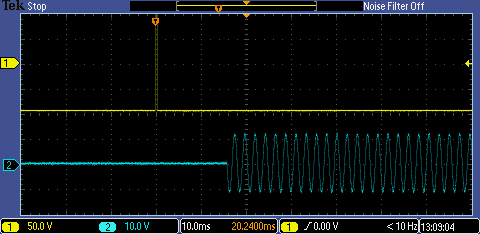

Timing and empirical testing of Expyriment
==========================================

**How accurate is the timing in Expyriment?**

In general, the Expyriment clock can feature up to 1 ms accuracy. The exact 
timing, however, is subject to various factors, which we discuss here.

Time and compatibility issues can be conveniently tested using the 
:doc:`Expyriment test suite <Testsuite>`.

Stimulus presentation
---------------------

Visual
~~~~~~
Computer screens are updated according to their refresh rate. What happens then 
is that the whole screen is redrawn line by line all the time. For example, 
with a refresh rate of 60Hz, the screen is redrawn 60 times per second (1000ms) 
and the duration it takes to redraw it line by line is 16.66 ms (1000/60).
When attempting to redraw the screen while it is currently already being 
updated (the lines are drawn) the result might lead to artifacts, since the 
update occurs immediately, leading to parts of both, the new and the old screen 
content, being visible. What is even worse is that you will never know in which 
phase of the redrawing the new redraw was started. Thus, you cannot be sure 
when exactly the new content is fully visible on screen. This should be the
behaviour of Expyriment, when OpenGL is switched off
(``control.defaults.open_gl=0``; see :doc:`Defaults`)

The first step towards getting around this problem is to synchronize the actual 
redraw to the vertical retrace of the screen. This means that a change in 
content will never happen immediately, but always only when the retrace is at 
the top left position. When synchronizing to the vertical retrace, the graphic 
card is told to update the screen the next time it starts redrawing the first 
line. This should be the behaviour of Expyriment, when OpenGL is switched on
and set to "vsync / no blocking" (``control.defaults.open_gl=1``; see :doc:`Defaults`).
While this will solve the problem of artifacts, you will still face the
problem of not knowing when exactly something was visible on the screen, since
the graphic card handles this synchronization itself in the background.

Solving this problem is the exact (and only) reason why Expyriment will use
OpenGL set to "vsync / blocking" (``control.defaults.open_gl=2``; see :doc:`Defaults`) by default.
It allows to wait for the vertical retrace to actually happen before
proceeding with the code that tells the graphics card to update the screen
(this is also known as blocking on the vertical retrace). This means that
whenever something should be presented on screen, no matter in which line the
redraw is at this point in time, the graphic card will wait for the redraw to
be in the first line and then present the stimulus. Since the code is
blocking, the time Expyriment reports the stimulus to be presented on screen
will always be the time when the redraw is starting at the first line.
Coming back to the example of the small dot in the center of the screen:
Expyriment will correctly report a longer presentation time when the redraw
has been just over the center line when the screen update was issued.

In some rare cases, this blocking mechanism will not work. This is due to
specifics of the video card driver implementation. Should blocking on the
vertical retrace indeed not work (as can be revealed by the
:doc:`Expyriment test suite <Testsuite>`), an alternative blocking mechanism
is available by using OpenGL set to "vsync / alternative blocking"
(``control.defaults.open_gl=3``; see :doc:`Defaults`).

*It is important to set your graphic card's driver settings to support 
synchronizing to the vertical retrace ("Sync to VBlank" or "V-sync") and to 
switch off any power saving schemes on the graphic card.*
*Also, please be aware that blocking on the vertical retrace is not accurate
in window mode!*

**Test results**

We tested the visual timing by presented a white and a black fullscreen 
rectangle directly after each other. The brightness of the left upper edge of 
the screen was recorded using an optic sensor attached to an oscilloscope.  
After each screen presentation, a marker was send via the serial port to the 
oscilloscope. Testing was done on an Intel Core Duo PC with an Nvidia Quadro 
NVS 290 graphics card, running Microsoft Windows XP SP3. The monitor used was a 
Samsung SyncMaster 2233. Expyriment was running in the default OpenGL mode
(``control.defaults.open_gl=2``; see :doc:`Defaults`).

The results revealed:

* When presenting a stimulus, updating the screen does successfully block code 
  execution until the vertical retrace actually happens. This can be seen in 
  Figure 1, where the marker (yellow) lines up with the onset and offset of an 
  increase in brightness (turquoise) which represent the onset of the white and 
  the onset of the black screen, respectively.
* Presenting (preloaded) stimuli can accurately be done each refresh rate 
  (Figure 2).

Visual stimulus presentation is time locked to the vertical retrace.

   
Visual stimuli can be presented each refresh rate.

Audio
-----
Playing back audio is handled by PyGame. The present() and play() methods of 
auditory stimuli will return immediately. Since the audio stream has to be sent 
to the hardware, there will still be a delay before the audio can be heard.  
Unfortunately, the latency of the sound onset is not known by Expyriment.  
However, it is assumed to be relatively stable over time. Setting the audio 
buffersize to a smaller value than the default can decrease the delay, but 
might result in distorted audio.

*It is important to set your samplerate, bitdepth and audio buffersize 
correctly. Setting the buffersize too low will result in distorted audio!*

**Test results**

We tested the audio timing by repeatedly playing back a beep tone (a 1 second 
sine wave). The output of the sound card was measured by an oscilloscope.  
Before starting playback of the beep, a marker was send via the serial port to 
the oscilloscope.  Testing was done on an Intel Core Duo PC with a Soundblaster 
Audigy sound card, running Microsoft Windows XP SP3. In Expyriment, the 
samplerate was set to 44100 Hz, bitdepth to 16 bit and the buffersize equaled 128.

The results revealed:

* Audio playback was subject to a latency of maximally 20 ms. Figure 1 shows 
  the maximal measured latency between the start of the playback (yellow) and 
  the onset of the sound (turquoise).
* This latency was relatively stable with a jitter of 5 ms. Figure 2 shows the 
  minimal latency we could measure.

Maximal measured audio latency.

Minimal measured audio latency

Video
~~~~~

Video presentation is a tricky subject. In Expyriment, the present() method of 
a video stimulus will start playback and present the first (current) frame on 
the screen. Thus, visual onset of this frame can be synchronized with the
vertical retrace (see visual stimulus presentation above). Each following frame 
has to be plotted on the screen and the screen has to be updated. The 
wait_end() method of a video stimulus will automatically present each frame on 
the screen until the video is over. When Expyriment is in OpenGL mode "vsync /
(alternative) blocking", the process of plotting each frame might take longer
than one refresh rate which will result in dropping frames (e.g. frames not
being presented at all). To control for this, the wait_end() method will
report and log if any frames were dropped during video playback.

Measuring user input
--------------------

In Expyriment all inputs (keybard, mouse, gameport, serial port, parallel port) 
can be checked by directly polling them (via the wait() methods of the 
corresponding io object). This allows for the most accurate timing possible.  
Since Python wraps C functions for getting the system time, the accuracy is 
even more precise than milliseconds (which is the unit Expyriment uses).

Expyriment does *not* have a main event loop (i.e. it will not automatically 
check for any incoming events in the background)! This was a design decision, 
since we think that in 99% of all cases the time of the user input is specified 
in the design and thus know beforehand (e.g. a response after a stimulus 
onset). Adding an event loop would make things unnecessarily more complicated 
for those 99%.

However, we also thought of those cases that need to check user input during 
other operations: All events can manually be pushed from either Pygame's event 
cue (keyboard, mouse, joystick) or the operating system's buffer (serial port, 
parallel port) into an EventBuffer object. Doing this regularly is up to the 
user.

Keyboard
~~~~~~~~
Keyboards (PS2 and USB) are known to have poor timing accuracy. Usually these 
are in the range of several 100th of a second.

**Test results**

We tested the timing of a Logitec USB keyboard in Windows XP SP3 using optical 
tracking.  

Our results revealed:

* A timing accuracy between 20 and 26 ms.

Mouse
~~~~~
On most operating systems, USB mice are polled at a rate of 8 ms. Mice with 
special drivers might be set to poll more often.

**Test results**

We tested the mouse accuracy of a standard USB mouse on Windows XP SP3 by 
measuring the time between reported position changes.

Our results revealed:

* The expected standard accuracy of 8 ms.
* Using a Logitec G700 USB mouse with a dedicated driver, polling rates could A  
  be reduced, leading to an increased accuracy of 1 ms.

Serial port
~~~~~~~~~~~
The serial port is very accurate and thus suited for timing accurate 
measurements. If a computer does not have a serial port, USB-to-serial 
converter can be used (e.g. from Sweex or Keyspan). However, the timing 
accuracy of these depends on the implementation and drivers used!

*It is important to deactivate any additional FIFO buffers or delays, provided 
by the port driver!*

**Test results**

We tested the timing of a UART 16550A serial port (a real one, not a 
USB-to-serial converter!) on Windows XP SP3 by sending a byte to a connected 
loopback device which immediately sends the byte back. We then measured the 
time between sending and receiving. We repeated this process 1000 times.

Our results revealed:

* With a baudrate of 115200, the maximal measured time between sending and 
  receiving a byte was 0.283894736842 ms.
* With a baudrate of 19200, the maximal measured time between sending and 
  receiving a byte was 0.689593984962 ms.

Parallel port
~~~~~~~~~~~~~
The parallel port works by directly applying a current (writing) and measuring 
if a current is applied (sending) to several pins on the connector. Expyriment 
is only able to read from Acknowledge, Paper-Out and Selected pins!

